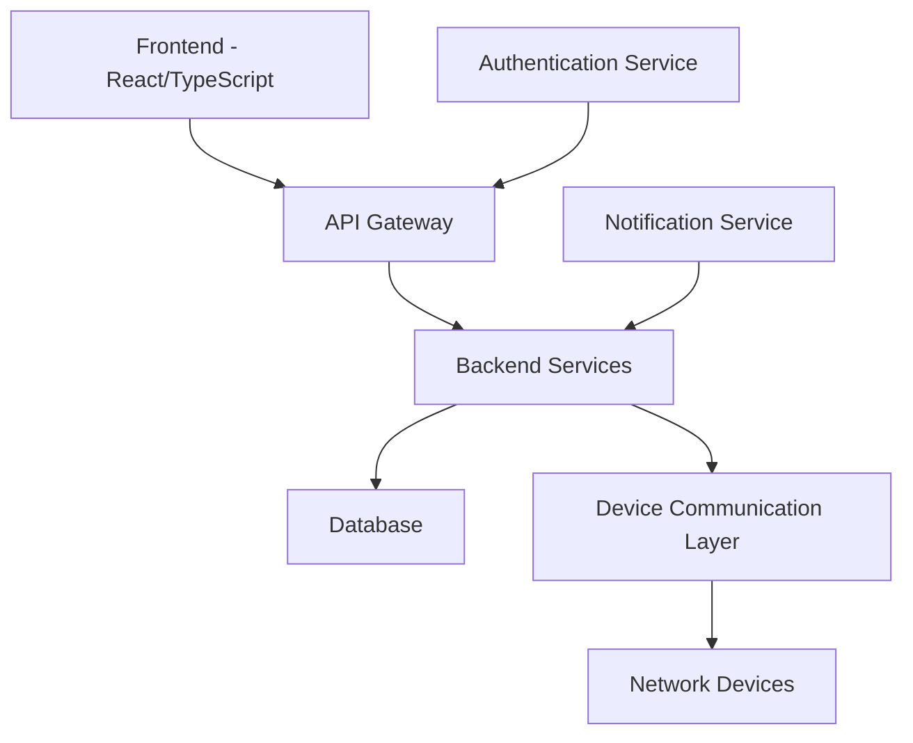
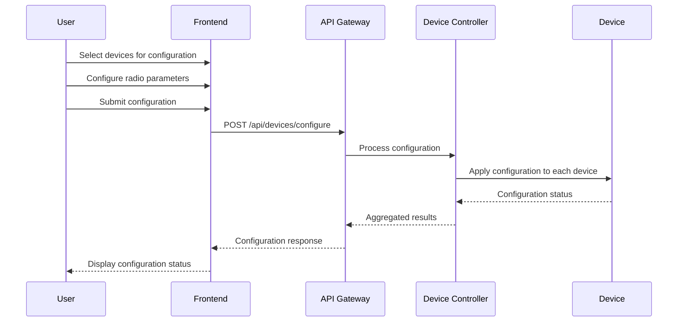
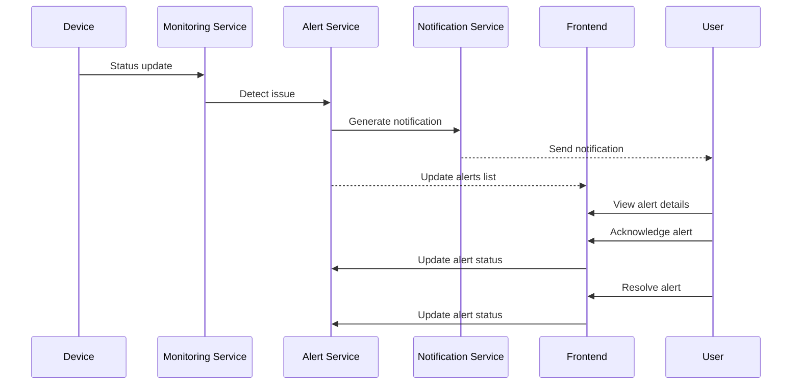

# Design Document: Radiance Network Management - UX/UI Prototype

## Overview

Radiance Network Management to prototyp UX/UI demonstrujący nowoczesne podejście do projektowania interfejsów użytkownika dla aplikacji biznesowych. Projekt został stworzony jako showcase umiejętności w zakresie:

- **UX/UI Design** - projektowanie intuicyjnych i estetycznych interfejsów
- **Frontend Development** - implementacja w React/TypeScript z najlepszymi praktykami
- **Design Systems** - tworzenie spójnych i skalowalnych systemów projektowych
- **Responsive Design** - dostosowanie do różnych urządzeń i rozmiarów ekranu
- **Accessibility** - projektowanie dostępnych interfejsów zgodnych z WCAG

Prototyp służy jako przykład profesjonalnego podejścia do tworzenia aplikacji webowych dla sektora enterprise.

## Architektura

System został zaprojektowany w architekturze klient-serwer z wykorzystaniem nowoczesnych technologii webowych. Aplikacja składa się z następujących głównych komponentów:

### Frontend

Frontend aplikacji został zbudowany przy użyciu następujących technologii:
- React - biblioteka do budowy interfejsu użytkownika
- TypeScript - typowany język programowania zwiększający bezpieczeństwo kodu
- Vite - narzędzie do budowy i rozwoju aplikacji
- Tailwind CSS - framework CSS do szybkiego tworzenia responsywnych interfejsów
- shadcn/ui - biblioteka komponentów UI oparta na Radix UI i Tailwind CSS

### Backend

Backend systemu powinien być zbudowany z wykorzystaniem:
- RESTful API lub GraphQL do komunikacji między frontendem a backendem
- Baza danych do przechowywania informacji o urządzeniach, użytkownikach, konfiguracji i historii zdarzeń
- System autentykacji i autoryzacji do zarządzania dostępem użytkowników
- Mechanizmy do komunikacji z urządzeniami sieciowymi (SNMP, SSH, API)

### Komunikacja z urządzeniami

System będzie komunikował się z urządzeniami sieciowymi za pomocą:
- Protokołu SNMP do monitorowania stanu urządzeń
- SSH lub dedykowanych API do konfiguracji urządzeń
- Websockets do aktualizacji danych w czasie rzeczywistym

## Komponenty i Interfejsy

### Komponenty Frontendowe

1. **Dashboard**
   - Wyświetla ogólny stan sieci
   - Prezentuje karty statystyk (aktywne urządzenia, urządzenia offline, ostrzeżenia, uptime)
   - Pokazuje feed aktywności z ostatnimi zdarzeniami

2. **Zarządzanie Urządzeniami**
   - Lista urządzeń z możliwością filtrowania i wyszukiwania
   - Szczegółowy widok urządzenia z informacjami o statusie, konfiguracji i historii
   - Kreator konfiguracji urządzeń z możliwością konfiguracji wielu urządzeń jednocześnie

3. **Mapa Sieci**
   - Interaktywna mapa pokazująca rozmieszczenie urządzeń
   - Wizualizacja stanu urządzeń za pomocą kolorów
   - Możliwość grupowania urządzeń według lokalizacji lub innych kryteriów

4. **Analityka**
   - Wykresy i statystyki dotyczące wydajności sieci
   - Filtry czasowe do analizy danych
   - Eksport raportów w różnych formatach

5. **Alerty**
   - Lista aktywnych alertów z możliwością filtrowania według priorytetu
   - Szczegółowy widok alertu z informacjami o przyczynie i możliwych rozwiązaniach
   - Interfejs do potwierdzania i rozwiązywania alertów

6. **Zarządzanie Użytkownikami**
   - Lista użytkowników z informacjami o rolach i uprawnieniach
   - Formularze do tworzenia i edycji użytkowników
   - Zarządzanie rolami i uprawnieniami

7. **Ustawienia Systemowe**
   - Konfiguracja globalnych ustawień systemu
   - Zarządzanie kopiami zapasowymi
   - Konfiguracja powiadomień

### Interfejsy API

1. **API Urządzeń**
   - GET /api/devices - pobieranie listy urządzeń
   - GET /api/devices/{id} - pobieranie szczegółów urządzenia
   - POST /api/devices - dodawanie nowego urządzenia
   - PUT /api/devices/{id} - aktualizacja urządzenia
   - DELETE /api/devices/{id} - usuwanie urządzenia
   - POST /api/devices/configure - konfiguracja wielu urządzeń

2. **API Alertów**
   - GET /api/alerts - pobieranie listy alertów
   - GET /api/alerts/{id} - pobieranie szczegółów alertu
   - PUT /api/alerts/{id}/acknowledge - potwierdzanie alertu
   - PUT /api/alerts/{id}/resolve - rozwiązywanie alertu

3. **API Użytkowników**
   - GET /api/users - pobieranie listy użytkowników
   - GET /api/users/{id} - pobieranie szczegółów użytkownika
   - POST /api/users - tworzenie nowego użytkownika
   - PUT /api/users/{id} - aktualizacja użytkownika
   - DELETE /api/users/{id} - usuwanie użytkownika
   - POST /api/users/{id}/reset-password - resetowanie hasła użytkownika

4. **API Analityki**
   - GET /api/analytics/performance - pobieranie danych o wydajności sieci
   - GET /api/analytics/devices - pobieranie statystyk urządzeń
   - GET /api/analytics/reports - generowanie raportów

## Modele Danych

### Device (Urządzenie)

```typescript
interface Device {
  id: string;
  name: string;
  model: string;
  macAddress: string;
  ipAddress: string;
  status: 'active' | 'offline' | 'warning';
  location: string;
  lastSeen: Date;
  firmwareVersion: string;
  radioConfig: RadioConfig;
  ssidConfig: SSIDConfig[];
}

interface RadioConfig {
  frequencyBand: '2.4ghz' | '5ghz';
  channel: string;
  channelWidth: '20mhz' | '40mhz' | '80mhz';
  transmitPower: 'auto' | 'low' | 'medium' | 'high';
  operationMode: 'ap' | 'station' | 'monitor';
  radioProtocol: '802.11ax' | '802.11ac' | '802.11n';
}

interface SSIDConfig {
  id: string;
  name: string;
  enabled: boolean;
  broadcast: boolean;
  security: 'wpa3' | 'wpa2' | 'open';
  password?: string;
}
```

### Alert (Alert)

```typescript
interface Alert {
  id: string;
  deviceId: string;
  type: 'connection' | 'performance' | 'security' | 'system';
  priority: 'low' | 'medium' | 'high' | 'critical';
  message: string;
  timestamp: Date;
  status: 'active' | 'acknowledged' | 'resolved';
  acknowledgedBy?: string;
  resolvedBy?: string;
  resolvedAt?: Date;
}
```

### User (Użytkownik)

```typescript
interface User {
  id: string;
  username: string;
  email: string;
  firstName: string;
  lastName: string;
  role: 'admin' | 'technician' | 'observer';
  lastLogin?: Date;
  createdAt: Date;
  updatedAt: Date;
}
```

### Activity (Aktywność)

```typescript
interface Activity {
  id: string;
  event: string;
  deviceId?: string;
  userId?: string;
  timestamp: Date;
  status: 'success' | 'warning' | 'info' | 'error';
}
```

## Obsługa Błędów

System będzie implementował kompleksową strategię obsługi błędów:

1. **Błędy API**
   - Standardowe kody HTTP dla różnych typów błędów (400, 401, 403, 404, 500)
   - Szczegółowe komunikaty błędów w odpowiedziach API
   - Logowanie błędów na serwerze

2. **Błędy Komunikacji z Urządzeniami**
   - Timeout dla operacji, które trwają zbyt długo
   - Automatyczne ponowne próby dla tymczasowych błędów
   - Generowanie alertów dla powtarzających się błędów

3. **Błędy UI**
   - Przyjazne dla użytkownika komunikaty błędów
   - Formularze z walidacją danych wejściowych
   - Obsługa stanu ładowania i błędów w komponentach

## Strategia Testowania

### Testy Jednostkowe

- Testy jednostkowe dla komponentów React
- Testy jednostkowe dla funkcji pomocniczych i utility
- Testy jednostkowe dla logiki biznesowej

### Testy Integracyjne

- Testy integracyjne dla API
- Testy integracyjne dla komunikacji między komponentami
- Testy integracyjne dla przepływów danych

### Testy End-to-End

- Testy E2E dla kluczowych przepływów użytkownika
- Testy E2E dla konfiguracji urządzeń
- Testy E2E dla zarządzania alertami

## Diagramy

### Diagram Architektury Systemu



### Diagram Przepływu Danych - Konfiguracja Urządzeń



### Diagram Przepływu Danych - Obsługa Alertów



## Bezpieczeństwo

System będzie implementował następujące mechanizmy bezpieczeństwa:

1. **Autentykacja**
   - Uwierzytelnianie oparte na tokenach JWT
   - Bezpieczne przechowywanie haseł z wykorzystaniem silnych algorytmów haszujących
   - Możliwość integracji z systemami SSO

2. **Autoryzacja**
   - System ról i uprawnień
   - Kontrola dostępu na poziomie API
   - Kontrola dostępu na poziomie UI

3. **Bezpieczeństwo Komunikacji**
   - Szyfrowanie komunikacji HTTPS
   - Szyfrowanie komunikacji z urządzeniami
   - Bezpieczne przechowywanie poświadczeń urządzeń

4. **Audyt**
   - Logowanie wszystkich istotnych działań użytkowników
   - Śledzenie zmian konfiguracji
   - Regularne audyty bezpieczeństwa